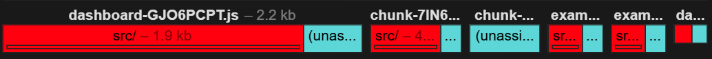

# Lazy-Loading Dynamic Components

## Preface

This project was generated using [Angular CLI](https://github.com/angular/angular-cli) version 21.1.2.
I assume you know what to do to run it.

## What's This About?

In large applications lazy loading parts of it through the router should be a default approach to keep the main bundle size as small as possible.
While you have to be disciplined about your code, what you import from where etc., this is something I assume you know enough about, so I don't have to explain it.

This is about having some kind of "dashboard" like component, which loads "widgets" depending on some kind of (user related) configuration.
Usually the user is able to select widgets from a collection that can contain a lot of different types of widgets.
And they are able to arrange them on some kind of dashboard (which can be just a simple list).

If your widget collection only contains a handful of different types, then this is overkill.
But if you provide a rather large collection from which only a handful is needed, you may want to structure your code in a way, your main bundle doesn't contain any widget related code.
After loading the configuration (which can be static, of course), only the needed code of the widgets should be loaded.

In this codebase I want to describe a technique I found useful for these kind of usecases.

## Naming Conventions

Instead of writing "lazy loadable dynamic component" I use "widget" as a shorthand.

## Setup

I activated `namedChunks`, `sourceMap` and `statsJson` in the production configuration, so it's easier to see, which code ends up in which chunk.
You should explore the contents of the `dist` folder to see, which code ends up in which chunk.
You can use the source-map-explorer for this.
Or upload the [`stats.json`](./dist/lazy-dynamic-component/stats.json) (only present after the `ng build`) to an [analyzer](https://esbuild.github.io/analyze/).

## Do Keep In Mind

- Make your ["load the type of the component" function](./src/app/widget-definition/widget-definition.ts) async and use dynamic imports like `loadChildren` in a route.
- Make your [widget "self-contained"](./src/app/widgets/example-1/example-1.ts), which means, don't import anything from outside the widget's folder.
  And if you have to, make it `import type ...`, so it's only a dependency at compile time and not at runtime.
  Otherwise whatever you import might end up in the main bundle (which can be ok, it depends on your circumstances).

## How

The "widget definitions" are small, almost static configuration data.
It's ok they all end up in the main bundle.
I like to use dependency injection to access these informations.
Every feature module can define its own widgets and your app collects them from all over the place => vertical slicing!

The "selector" of a widget definition serves the same purpose like a component's selector: (globally) identify the selected widget.
It's just a string, make it globally unique using "namespacing" or whatever you might come up with.

The [`injectWidgetDefinitions`](./src/app/widget-definition/widget-definition.client.ts) is just a fancy way to encapsulate the retrieval of the selected widgets.
Creating different "inject" functions is a powerful tool in Angular.

The [`WidgetHost`](./src/app/dashboard/widget-host.ts) is the magic piece, that dynamically loads the selected component.
It wraps the `getComponentType` function in a resource (but it could be anything capable of handling a `Promise`).
And when that resolves it uses the `ViewContainerRef` of the host to create and mount the component into the DOM.

And finally the [`Dashboard`](./src/app/dashboard/dashboard.ts) connects all the dots.
It may load the desired configuration from some backend - it's not really important, but it should be signalised, of course.
The config may contain positions for a grid layout - that depends on your dashboard implementation.
Almost everything is possible!

## The Output

Take a look at the important part of the `dist` folder:

- The first chunk contains the component for the dashboard and the widget-host.
- The second chunk contains the code for the widget definitions (client, inject function etc.).
- Ignore the third...
- In the fourth is the code for the "example 1" widget,
- And in the fifth is the code for the "example 2" widget.
- And in the last one are the routes from the dashboard (not important for this pattern).

And then there's the main bundle.
It contains (besides the actual app) all the definitions of all provided widgets.
One definition is ~140 bytes.

If even that's too much for your main bundle, I guess you can extend this example load even the definitions in a lazy way...

## Epilogue

Have fun! 😎
